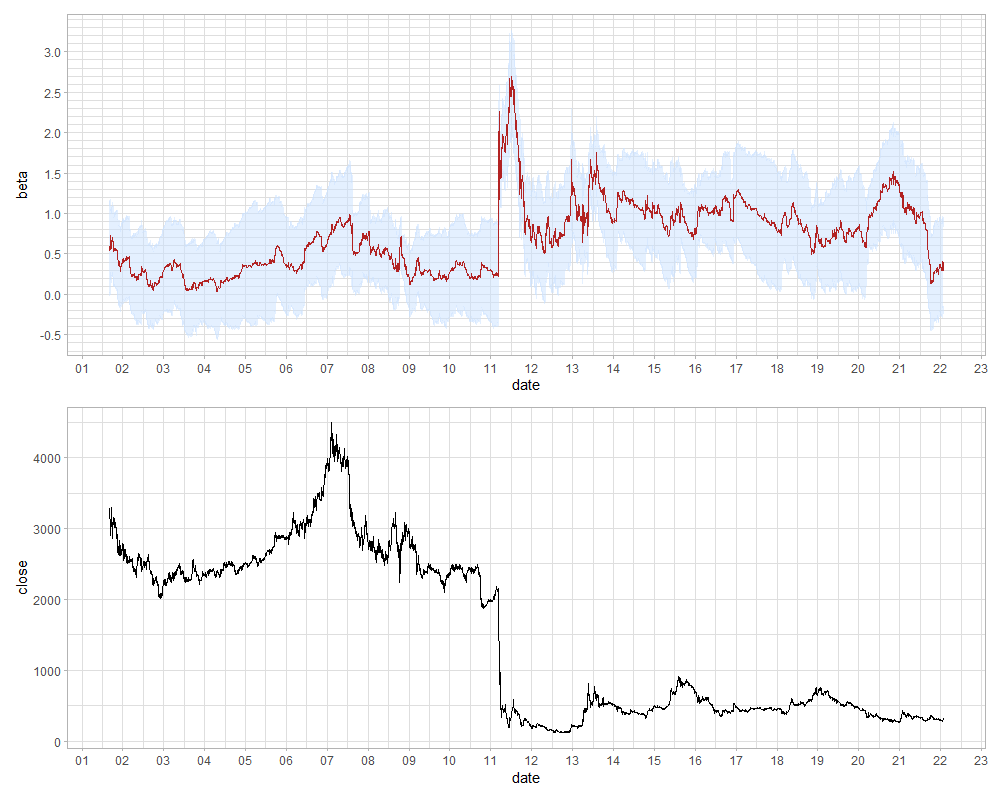

```{r setup, include=FALSE}
# メモ: results="hide"/code_folding:trueからのclass.source="fold-show"

knitr::opts_chunk$set(echo=TRUE,include=TRUE,message=FALSE,warning=FALSE,error=FALSE,tidy=FALSE,cache=FALSE)
# 例：out.width="800px",out.height="400px",fig.width=6,fig.height=3,dpi=300
# -> 画像そのものは3600(6*300*2)x1800(3*300*2)であり、それを画面上800x400に縮小して表示する
# out.width="100%"とすると、cssの横幅（約890px）となる
knitr::opts_chunk$set(out.width="100%",fig.width=8,fig.height=4,dpi=300)
library(tidyverse)
library(magrittr)
library(knitr)
library(here)
```

## 概要

- 東京電力HD株のベータ値をカルマンフィルタで推定しました。
  - [ベータ値](https://media.rakuten-sec.net/articles/-/2819)とは、市場平均株価（TOPIXや日経平均株価など）の変動と比べて個別株式の変動がどの程度大きいかを表す指標です。1より大きければその銘柄は市場平均より変動が激しく、1より小さければ市場平均より変動が穏やかなことを示します。市場平均に対するリスクの大きさを意味します。
- 2011年の東日本大震災と原発事故以前は、東京電力株はディフェンシブ銘柄（内需株。一般に値動きが穏やかでベータが1を下回ることが多い）の代表格でしたが、東日本大震災で急上昇し、それ以降値動きが荒くリスクが高い様子が見て取れました。
- [使用したコード](https://github.com/suzuna/stock_beta)

## ベータ値の定式化とその推定方法

金融分野では、リスクの大きさとは値動きの荒さを指します。値動きの荒さとは、日次の株価（株式でなくてもよいですが、以下株式を考えます）の対前日変動率[^1]の分布の幅の大きさから求められ、変動率の分布を特に正規分布と仮定するならば[^2]、その分布の標準偏差になります。

[^1]: 日次ではなく、週次や月次の株価を用いて、対前週や前月の変動率とすることもあります。逆に、分単位のような細かな感覚の株価を用いて計算することもあります。
[^2]: 実際には正規分布ではなく、正規分布より裾が厚い分布であることが知られています。正規分布とみなしても問題ない場合は、計算の簡単さのため正規分布とみなして諸々の計算を行うことが多いです。

$S_t, S_t^{M}$をそれぞれ$t$日における個別株式の終値と市場全体の指数[^3]の終値とするとき、$t$日における個別株式の対前日変動率と市場全体の指数の対前日変動率$r_t, r_t^{M}$は以下のように計算されます[^4]。

\begin{align}
r_t &= \log S_t  - \log S_{t-1} \\
r_t^{M} &= \log r_t^{M} - \log r_{t-1}^{M}
\end{align}

[^3]: TOPIXと並ぶ市場平均である日経平均株価は、東証1部約2100銘柄のうち225銘柄からでしか計算されないこと、またファーストリテイリング（ユニクロ）やソフトバンクのような株価が大きい銘柄の変動が指数に非常に大きな影響を与えることから、このような分析に用いる市場平均としてはTOPIXの方が好ましい性質があります。
[^4]: 普通変動率と聞いてイメージする$r_t = ({S_t} / S_{t-1})-1$ではなく対数変化率を取るのが一般的です。テイラー展開より小さな変化率では通常の変化率と近似できる上に、同率の上昇と下落で元に戻り、各期の変化率を足すと複数期間の変化率となる便利な性質があるためです。また、100を掛けてパーセント表記とすることもあります。

この時、ベータ値は、下記の$\beta_t$です。

$$
r_t = \alpha_t + \beta_t r_t^{M} + \epsilon_t, \quad \epsilon_t \sim \mathcal{N}(0, \sigma)
$$

$\alpha_t$は有意に正でも負でもないことが実証的に知られている[^5]ことから、$\alpha_t=0$とした下記のモデルを用い、この$\beta_t$とすることが一般的です。

$$
r_t = \beta_t r_t^{M} + \epsilon_t, \quad \epsilon_t \sim \mathcal{N}(0, \sigma)
$$

[^5]: 両辺期待値を取り、$E[r_t] = E[\alpha_t] + E[\beta_t r_t^{M}] = \alpha_t + \beta_t E[r_t^{M}]$です。$E[r_t]=0, E[r_t^{M}]=0$であれば$E[\alpha_t]=0$となります。$E[r_t]=0, E[r_t^{M}]=0$であることは多くの実証研究で示されていますし（例えば、T. Andersen, et al. (2001) The distribution of realized stock return volatility, Journal of Financial Economics 61, 43-76.）、$\alpha_t$を入れた式でベータ値を推定すると、大抵の場合$\alpha_t$は有意なパラメータではありません。

$\beta_t$は、過去一定期間（1年～3年程度）の$r_t, r_t^{M}$を用いて回帰で求められます。ローリング回帰することで各$t$における$\beta_t$を得るというのがベータ値の簡単な推定方法です。

しかしこの方法は、ローリング回帰に用いた標本期間の間ではベータ値が変化しないことを前提としています。ベータ値は日次で変動するため、より精緻に求めるには下記の状態空間モデルから推定します[^6]。このベータ値は時変ベータと呼ばれることもあります。

\begin{align}
観測方程式: r_t &= \beta_t r_t^{M} + e_t, \quad e_t \sim \mathcal{N}(0, \sigma^{e}) \\
状態方程式: \beta_t &= \beta_{t-1} + \epsilon_t, \quad \epsilon_t \sim \mathcal{N}(0, \sigma^{\epsilon})
\end{align}

状態空間モデルは、時系列データにおいて動的な時系列回帰を行う目的で用いられることがよくありますね。

これは線形・ガウスの状態空間モデルです。線形・ガウスなので、行列計算で高速にパラメータが求まるカルマンフィルタ[^7]を適用することができます。

[^6]: ベータ値のモデルには、より複雑な非線形の状態空間モデルも存在します。
[^7]: 飛行中のアポロ11号の位置を推定するのに用いられたという逸話があります。

## 実装

### データの整形

2001/6/25～2022/1/30の東京電力HD（9501）の株価と、同期間のTOPIXを用いました。株価データは私が口座を持っている証券会社よりCSVでダウンロードすることができましたので、そのCSVを使用しています。

CSVのパスを与えると、不要な行・列を飛ばして読み込み、終値の前日に対する対数変化率（100倍してパーセント表記にする）を計算する関数を作っています。1日ラグを取る都合上、初日の対数変化率はNAになるため、1行目を削除しています。

closeは終値、retは対前日の対数変化率を指します。

```{r}
library(tidyverse)
library(lubridate)
library(KFAS)
library(here)


source(here("script/utils.R"),encoding="UTF-8")
source(here("script/utils_kfas.R"),encoding="UTF-8")


# データの読み込み ----------------------------------------------------------------
tepco <- read_stockcsv_daily(here("data/9501_tepcoHD.csv"),"9501_tepcoHD")
topix <- read_stockcsv_daily(here("data/topix.csv"),"0000_topix")
nikkei <- read_stockcsv_daily(here("data/nikkei.csv"),"0001_nikkei")

df <- left_join(
  tepco %>% 
    select(date,close,ret),
  topix %>% 
    select(date,close,ret) %>% 
    rename(close_topix=close,ret_topix=ret),
  by="date"
) %>% 
  # 最初の1日目の対数変化率がNAなのを除外する
  slice(2:nrow(.))

df
```


### ベータ値の推定

RでカルマンフィルタをするにはdlmとKFASがありますが、今回はKFASを用いています。

上記の観測方程式・状態方程式を定義します。状態誤差の分散（$\sigma^{\epsilon}$）と観測誤差の分散（$\sigma^{e}$）は未知数です。カルマンフィルタの尤度関数を最大化するような状態誤差の分散と観測誤差の分散を求めるために、inits_bestで最適化関数optimのための初期値を与え、その下で尤度関数を最大にするように計算しています（fitSSMの中ではoptimが回っています）。

初期値によっては局所解に落ちるので、本当は複数のinitsを与えて尤度を比較する方が良いですが、下記のコードのinits_bestは一旦決め打ちにしています。なお、initsをグリッドサーチで回すコードはリポジトリにあります。

```{r,eval=FALSE}
# KFASでベータの推定 --------------------------------------------------------------------
# 状態空間モデルの定義
mod <- SSModel(
  # 観測誤差の分散
  H=NA,
  # SSMregression内のret_topix-1の-1は状態方程式に切片がないことを、
  # SSMregression外の-1は観測方程式に切片（alpha）がないことを示す
  # Qは状態誤差の分散
  ret ~ SSMregression(~ret_topix-1,Q=NA)-1,
  data=df
)

# 決め打ちする
inits_best <- c(0,0)
# 尤度を最大にするHとQを求める
fit <- fitSSM(mod,inits=inits_best,method="BFGS")
# 尤度を最大にするHとQの下で状態を推定する
kfs <- KFS(fit$model,filtering=c("state","mean"),smoothing=c("state","mean"))
```

ベータ値のフィルタ化推定量と平滑化推定量の両方について、推定値と与えた信頼区間での幅を求めます。

```{r,eval=FALSE}
# 推定されたベータ値を取り出しプロットする --------------------------------------------------------------------
extract_param <- function(kfs,param_name,date,confidence_interval=0.95) {
  idx_param_of_std_error <- which(colnames(kfs$att)==param_name)
  upper <- confidence_interval+(1-confidence_interval)/2
  lower <- (1-confidence_interval)/2
  df <- data.frame(
    filtered=as.numeric(kfs$att[,param_name]),
    std_error_filtered=sqrt(kfs$Ptt[idx_param_of_std_error,idx_param_of_std_error,]),
    smoothed=as.numeric(kfs$alphahat[,param_name]),
    std_error_smoothed=sqrt(kfs$V[idx_param_of_std_error,idx_param_of_std_error,])
  ) %>% 
    add_column(date=date,.before=1) %>% 
    mutate(
      filtered_upper=filtered+qnorm(upper)*std_error_filtered,
      filtered_lower=filtered+qnorm(lower)*std_error_filtered,
      smoothed_upper=smoothed+qnorm(upper)*std_error_smoothed,
      smoothed_lower=smoothed+qnorm(lower)*std_error_smoothed
    )
}

res <- extract_param(kfs,"ret_topix",df$date,0.95)
res <- full_join(df,res,by="date") %>% 
  slice(51:nrow(.))
```

## 結果

こちらが結果です。

- 上のグラフが東京電力株のベータ値（フィルタ化推定量）、下のグラフは東京電力株の株価（終値）です。
- 上のグラフは赤い線がベータ値のフィルタ化推定量、青いバンドはその95%信頼区間です。
- 横軸の数字は年の下2桁です。
- 最初の方は推定されたベータの値が暴れていますので、最初の50日分を除外しています。

```{r,eval=FALSE}
plot_beta <- res %>%
  select(date,filtered,filtered_upper,filtered_lower) %>%
  ggplot(aes(x=date))+theme_light()+
  geom_ribbon(aes(ymin=filtered_lower,ymax=filtered_upper),fill="lightsteelblue1",alpha=0.5)+
  geom_line(aes(y=filtered_lower),color="lightsteelblue1",alpha=0.5)+
  geom_line(aes(y=filtered_upper),color="lightsteelblue1",alpha=0.5)+
  geom_line(aes(y=filtered),color="firebrick")+
  scale_x_date(breaks=scales::date_breaks("1 year"),date_labels="%y")+
  scale_y_continuous(breaks=seq(-2,5,0.5),minor_breaks=seq(-2,5,0.1))+
  labs(x="date",y="beta")

plot_close <- res %>% 
  select(date,close) %>% 
  ggplot(aes(x=date,y=close))+theme_light()+geom_line()+
  scale_x_date(breaks=scales::date_breaks("1 year"),date_labels="%y")+
  labs(x="date",y="close")

patchwork::wrap_plots(plot_beta,plot_close,ncol=1)
```



東日本大震災まではベータ値の推定値は1を下回っています。低リスクなディフェンシブ銘柄の代表格として知られ、値動きが穏やかで配当が安定、倒産リスクはほぼないとされていました。しかし東日本大震災を機にベータ値が急上昇、その後もしばらくは1を超えて推移していることが分かります。急騰している所が2011/3/14です。

因果関係については示していないので、このベータの変動が東日本大震災と原発事故とその後の電力会社を取り巻く環境によるものだと断言することはできないことに注意が必要です。ただ、原発を持たない沖縄電力以外の電力会社は同様に東日本大震災を境にベータの振る舞いが変わっているものの、沖縄電力だけはあまり変わっていないという先行研究[^8]もあります。

[^8]: 森平爽一郎（2019）「経済・ファイナンスのためのカルマンフィルター入門」朝倉書店。
