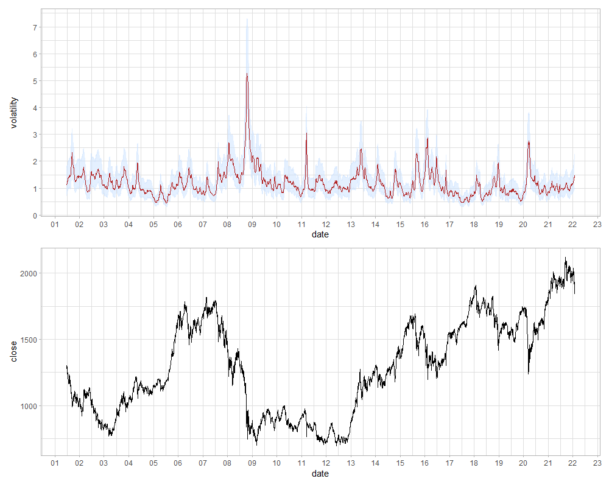

```{r setup, include=FALSE}
# メモ: results="hide"/code_folding:trueからのclass.source="fold-show"

knitr::opts_chunk$set(echo=TRUE,include=TRUE,message=FALSE,warning=FALSE,error=FALSE,tidy=FALSE,cache=FALSE)
# 例：out.width="800px",out.height="400px",fig.width=6,fig.height=3,dpi=300
# -> 画像そのものは3600(6*300*2)x1800(3*300*2)であり、それを画面上800x400に縮小して表示する
# out.width="100%"とすると、cssの横幅（約890px）となる
knitr::opts_chunk$set(out.width="100%",fig.width=8,fig.height=4,dpi=300)
library(tidyverse)
library(magrittr)
library(knitr)
library(here)
```

## 概要

- 非線形な状態空間モデルであるStochastic Volatility (SV) モデルを用いて、TOPIXのボラティリティをStanで推定しました。
  - ボラティリティとは、株式などの金融商品の価格の変動の大きさを表す値です。
- 推定されたボラティリティは、2009年のリーマンショックと、2011年の東日本大震災、2020年のコロナ禍初期で非常に高まっていることを確認できました。
- [使用したコード](https://github.com/suzuna/stock-model)

## ボラティリティの定式化とその推定

$S_t$を$t$日における株式（株式に限らず為替などでもよいですが、以下株式とします）の価格とするとき、$t$日における対前日の収益率$r_t$は$r_t=\log S_t  - \log S_{t-1}$となります。このとき、ボラティリティとは下記の$\sigma_t$、あるいは$\sigma_t^2$を指します。

[^1]: どちらをボラティリティと呼ぶかは文献による気がします。

\begin{align}
r_t &= E_{t-1}[r_t] + \epsilon_t,\\
\epsilon_t &= \sigma_t z_t, \quad \sigma_t > 0, \quad z_t \sim i.i.d., \quad E[z_t] = 0, \quad Var[z_t] = 1
\end{align}

なお、一般に$E_{t-1}[r_t]=0$であることが多くの実証研究で示されています。$\sigma_t$と$\sigma_t^2$のどちらをボラティリティと呼ぶかは文献による気がしますが、以降$\sigma_t$をボラティリティと呼びます。

さて、この$\sigma_t$を推定する方法ですが、大きく分けて3通りあります。

一つ目の方法は、過去一定期間の$r_t$、すなわち$\{r_{t-j},r_{t-j+1},\dots r_{t}\}$の標準偏差とする方法です。この方法は、標準偏差を計算しているサンプルである$t-j,\dots,t$の間は$\sigma_t$が一定と仮定しています。

二つ目の方法は、$\sigma_t$を統計的なモデルで定式化するものです。GARCHモデルはこのカテゴリに含まれます[^1]。このタイプのモデルは色々ありますが、本記事ではStochastic Volatility (SV) モデルを用います。SVモデルは下記のように定式化されます。

\begin{align}
y_t &= \exp(x_t/2) \epsilon_t, \quad \epsilon_t \sim i.i.d. N(0,1),\\
x_{t+1} &= \mu + \phi(x_t - \mu) + \eta_t, \eta_t \sim i.i.d. N(0,\sigma_{\eta}^2),\\
x_1 & \sim N(0,\sigma_{\eta}^2/(1-\phi^2)) \quad（x_{t}の無条件分布）\\
\end{align}

[^1]: GARCHモデルは疑似最尤法でパラメータが求まるので、粒子フィルタやStanなどで推定する必要がないのがメリットです。

$y_t$は対数収益率$r_t$です。ボラティリティ$\sigma_t$は$\exp(x_t/2)$です。

このモデルは、最初の式で$E_{t-1}[r_t]=0$とした上で、ボラティリティ$\sigma_t$の2乗の対数値$x_t$がAR(1)モデルに従うということを意味します。$|\phi|<1$とします[^2]。

[^2]: $x_t$は定常な過程と仮定しています。

このモデルは非線形な状態空間モデル（1本目の式が観測方程式、2本目の式が状態方程式）ですので、粒子フィルタかStanなどのMCMCで推定することになります。今回はStanを用います。

三つ目の方法としては、以上二つのように収益率$r_t$の時系列から$\sigma_t$を推定するのではなく、分単位のような細かい収益率データを用いて直接$\sigma_t$を求めるアプローチがあります。本記事からは外れるので詳細は触れませんが、$t$日における1分間隔や5分間隔程度の細かい間隔の収益率の2乗を1日分足し合わせたものが$\sigma_t$の推定量になり、この推定量をRealized Volatility[^3]と呼びます。

[^3]: 参考になる論文は例えばこちらがあります。渡部敏明, 佐々木浩二 (2006),  「ARCH型モデルと"Realized Volatilityによるボラティリティ予測とバリュー・アット・リスク」, 金融研究, 25 別冊(2), 39-74.

## 実装

### データの整形

2001/6/25～2022/1/30のTOPIXを用いました。データは私が口座を持っている証券会社からCSVでダウンロードしました。

CSVのパスを与えると、不要な行・列を飛ばして読み込み、終値の前日に対する対数変化率（100倍してパーセント表記にする）を計算する関数を作っています。1日ラグを取る都合上、初日の対数変化率はNAになるため、1行目を削除しています。

closeは終値、retは対前日の対数変化率を指します。

```{r,include=FALSE}
params <- read_csv(here("params.csv"))
vol <- read_csv(here("vol.csv"))
```

```{r,echo=FALSE}
library(tidyverse)
library(lubridate)
library(KFAS)
library(here)
library(rstan)
options(mc.cores=parallel::detectCores())
rstan_options(auto_write=TRUE)


source(here("script/utils.R"),encoding="UTF-8")
source(here("script/utils_kfas.R"),encoding="UTF-8")


# データの読み込み ----------------------------------------------------------------
topix <- read_stockcsv_daily(here("data/topix.csv"),"0000_topix")
df <- topix %>% 
  select(date,close,ret) %>% 
  # 最初の1日目の対数変化率がNAなのを除外する
  slice(2:nrow(.))

df
```

### Stanによるコード

上で挙げたSVモデルをStanコードにします。これを"script/model.stan"というファイル名で保存します。

```{stan,output.var="tmp",eval=FALSE,class.source="fold-show"}
data {
  int N;
  vector[N] y;
}

parameters {
  vector[N] x;
  real mu;
  real<lower=-1,upper=1> phi;
  real<lower=0> sigma_eta;
}

transformed parameters {
  real phi_beta;
  phi_beta = (phi+1)/2;
  real sigma_eta_square;
  sigma_eta_square = sigma_eta^2;
}

model {
  mu ~ normal(0,1);
  phi_beta ~ beta(20,1.5);
  sigma_eta_square ~ inv_gamma(5.0/2,0.05/2);
  
  // Stanのnormalの引数は分散ではなく標準偏差
  x[1] ~ normal(mu,sigma_eta/sqrt((1-phi^2)));
  x[2:N] ~ normal(mu + phi * (x[1:(N-1)] - mu),sigma_eta);
  y ~ normal(0,exp(x/2));
}

generated quantities {
  vector[N] vol;
  vol = exp(x/2);
}
```

以下、実装のポイントについて説明します。

- Stanのnormalの引数の2個目は、分散ではなく標準偏差を記します。
  - 確率変数$X$が平均$\mu$、分散$\sigma^2$（つまり標準偏差$\sigma$）の正規分布に従うことを$X \sim N(\mu,\sigma^2)$と書きますが、StanではN ~ (mu,sigma^2)ではなくN ~ (mu,sigma)と書きます。

- y ~ normal(0,exp(x/2))の部分
  - 正規分布の再生性より、平均$\mu$、分散$\sigma^2$の正規分布に従う確率変数$X$を定数$c$倍した確率変数$cX$は、平均$\mu$、分散$c^2 \sigma^2$の正規分布に従います。つまり、$cX \sim N(\mu,c^2 \sigma^2)$となることを利用しています。

- $\mu, \phi, \sigma_{\eta}$の事前分布は、SVモデルの元の論文であるKim, Shephard and Chib (1998) [^4]や、それを日本株に適用した大森, 渡部 (2007)[^5] にある下記の値を用いました。無情報事前分布ではなく、これらの事前分布を書いてあげると収束しやすくなります。IGは逆ガンマ分布です。$\phi \sim Uniform(-1,1)$でもいいとは思います。

\begin{align}
\mu & \sim N(0,1),\\
\frac{\phi+1}{2} & \sim Beta(20,1.5),\\
\sigma_{\eta}^2 & \sim IG(5/2, 0.05/2)\\
\end{align}

- $x[1]$の式を省略すると収束しにくくなります。

- generated quantitiesの項のvolが今回求めたいボラティリティです。$x$からR上で求めることもできますがStanで求めておきます。

[^4]: Kim, S., N. Shephard, and S. Chib (1998), "Stochastic Volatility: Likelihood Inference and Comparison with ARCH Models", Review of Economic Studies, 65, 361-393.
[^5]: 大森裕浩, 渡部敏明 (2007), 「MCMC法とその確率的ボラティリティモデルへの応用」CIRJEディスカッションペーパー, J-173, 1-39.

### モデルの推定と結果の抽出

chains=4,iter=30000,warmup=15000としました。Core i9-9900Kで2時間程度で推定できました。

省略しますがrstan::stan_traceで見られるchain plotは綺麗に混ざり合っており、全てのパラメータでRhat<1.01となっています。

```{r,eval=FALSE}
mod <- rstan::stan(
  here("script/model.stan"),
  data=list(
    N=nrow(df),
    y=df$ret
  ),
  chains=4,
  iter=30000,
  warmup=15000,
  seed=1234
)
```

volの中央値と95%信頼区間を取り出します。rstan::extract[^6]によって、vol[1]～vol[N]のNが行数、iter ×chainが列数である行列の推定値が取り出せるので、そこからapplyで中央値と2.5%点、97.5%点を取り出します。

[^6]: library(rstan)の後にlibrary(magrittr)するとrstan::extractがmagrittr::extractでオーバーライドされるので、コード上では"rstan::"と名前空間を明示しておくのがいいです。

```{r,eval=FALSE}
extract_param <- function(model,param_name,confidence_interval=0.95) {
  mat <- rstan::extract(model,param_name)[[1]]
  
  ci_upper <- confidence_interval+(1-confidence_interval)/2
  ci_lower <- (1-confidence_interval)/2
  
  res <- data.frame(
    median=apply(mat,2,function(x){quantile(x,0.5)}),
    mean=apply(mat,2,function(x){mean(x)}),
    lower=apply(mat,2,function(x){quantile(x,ci_upper)}),
    upper=apply(mat,2,function(x){quantile(x,ci_lower)})
  )
}

vol <- extract_param(mod,"vol") %>% 
  add_column(date=df$date,.before=1)
```

## 結果

こちらが結果です。

- 上のグラフが推定されたTOPIXのボラティリティ（$\sigma_t$）、下のグラフはTOPIXの終値です。
- 上のグラフは赤い線がボラティリティ、青いバンドはその95%信頼区間です。
- 横軸の数字は年の下2桁です。

```{r,eval=FALSE}
res <- left_join(vol,df,by="date")

plot_vol <- res %>% 
  ggplot(aes(x=date))+theme_light()+
  geom_ribbon(aes(ymin=lower,ymax=upper),fill="lightsteelblue1",alpha=0.5)+
  geom_line(aes(y=lower),color="lightsteelblue1",alpha=0.5)+
  geom_line(aes(y=upper),color="lightsteelblue1",alpha=0.5)+
  geom_line(aes(y=median),color="firebrick")+
  scale_x_date(breaks=scales::date_breaks("1 year"),date_labels="%y")+
  labs(x="date",y="volatility")

plot_close <- res %>% 
  select(date,close) %>% 
  ggplot(aes(x=date,y=close))+theme_light()+geom_line()+
  scale_x_date(breaks=scales::date_breaks("1 year"),date_labels="%y")+
  labs(x="date",y="close")

patchwork::wrap_plots(plot_vol,plot_close,ncol=1)
```



リーマンショックが2008/9/15、東日本大震災が2011/3/11、コロナ禍の急落が2020年前半ですが、ちょうどその辺りでボラティリティが高まっていることが分かります。

ちなみに、上のグラフで$\sigma_t=1$というのは、$r_t$の分散が1%ということです。

なお、$\phi$の推定値は下記の通り非常に1に近くなっています。SVモデルの式より、$\phi$はボラティリティの変動がどの程度後をひくかのパラメータです。これが1に近いということは持続性が非常に高い（ボラティリティ・クラスタリング[^7]と言います）ことを示します。通常1に近い値となります[^8]。

```{r}
params %>% 
  filter(param=="phi")
```

[^7]: ボラティリティが上昇（低下）するとしばらくボラティリティが高い（低い）日が続くこと。株式に限らず、金融市場でよく見られる現象です。
[^8]: SVモデルを推定した文献をサーベイすると$\phi$の推定値は0.8から0.995までの値となっているという論文があります（Jacquier, E., N. Polson, and P. Rossi (2004), "Bayesian Analysis of Stochastic Volatility Models (with Discussion)", Journal of Business & Economic Statistics, 12, 371-417.）。
